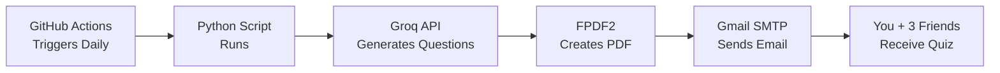

# 🔥 Daily GATE DA Quiz Mailer - 100% FREE!

<div align="center">


**Automated daily GATE DA questions for you + 3 friends. Zero costs. Zero hassle.** 💸

*No credit card. No cloud bills. Just free AI + free automation!*

</div>

---

## ✨ Features

- 🤖 **AI-Generated Questions** - Uses Groq API (LLaMA 3.1 70B) - SUPER FAST & FREE!
- 📧 **Auto Email Delivery** - Gmail SMTP sends to you + 3 friends daily
- 🔄 **Smart Topic Rotation** - Cycles through all 94 GATE DA topics systematically
- 📊 **Professional PDFs** - Clean formatting with questions and answers
- ⏰ **Automated Scheduling** - GitHub Actions runs daily at 6:00 AM IST
- 💯 **100% FREE** - No subscriptions, no hidden costs, EVER!

## 🚀 Quick Setup (15 Minutes)

### Step 1: Get Your FREE API Key (Groq)
1. Visit: https://console.groq.com/keys
2. Sign in with GitHub (instant!)
3. Click "Create API Key" → Copy it

### Step 2: Fork & Configure This Repo
1. **Fork this repository** to your GitHub account
2. Go to your forked repo's **Settings → Secrets → Actions**
3. Add these 4 secrets:

| Secret Name | Value | Where to Get |
|------------|-------|--------------|
| `GROQ_API_KEY` | `gsk_abc...` | https://console.groq.com/keys |
| `GMAIL_USER` | `your.email@gmail.com` | Your Gmail address |
| `GMAIL_PASS` | `xxxx xxxx xxxx xxxx` | Gmail App Password (see below) |
| `FRIENDS` | `friend1@gmail.com,friend2@gmail.com` | Comma-separated emails |

### Step 3: Get Gmail App Password
1. Enable 2-Step Verification: https://myaccount.google.com/security
2. Generate App Password: https://myaccount.google.com/apppasswords
3. Select "Mail" + "Other (Custom name)"
4. Copy the 16-character password

### Step 4: Test It!
1. Go to **Actions** tab in your repo
2. Click "Daily DA 2026 Quiz Mailer"
3. Click "Run workflow" → "Run workflow"
4. Wait 2-3 minutes → Check your email! 📧

## 💰 Why This is 100% FREE

| Service | Free Tier | What We Use | Cost |
|---------|-----------|-------------|------|
| **Groq API** | 30 requests/min | 8 requests/day | **$0** |
| **GitHub Actions** | 2,000 min/month | ~1 min/day = 30 min/month | **$0** |
| **Gmail SMTP** | Normal usage limits | 1 email/day to 4 people | **$0** |
| **GitHub Storage** | Unlimited for code | Few KB of JSON files | **$0** |

**Monthly Savings**: $50+ compared to paid quiz services! 💰

## 🛠️ Tech Stack (All FREE!)

- **AI Engine**: Groq API (LLaMA 3.1 70B) - 30 req/min free
- **Automation**: GitHub Actions - 2,000 min/month free
- **Email**: Gmail SMTP - Unlimited free emails
- **Language**: Python 3.11+
- **Libraries**: `fpdf2`, `requests`, `smtplib`

**Total Monthly Cost**: $0.00 (saves you ~$50/month vs paid services!)

## 📂 Project Structure

```
daily-gate-quiz-mailer/
├── generate_quiz.py              # Main script (AI + PDF + Email)
├── syllabus.json                 # 94 GATE DA topics across 8 subjects
├── requirements.txt              # Python dependencies
├── .github/workflows/daily.yml   # GitHub Actions automation
├── progress.json                 # Auto-generated topic tracker
└── README.md                     # This file
```

## 📚 GATE DA 2026 Syllabus Coverage

**8 Core Subjects | 94 High-Weightage Topics**

1. **Probability & Statistics** (17 topics)
2. **Linear Algebra** (13 topics)
3. **Calculus & Optimization** (6 topics)
4. **Programming & Data Structures** (11 topics)
5. **Database Management** (16 topics)
6. **Machine Learning - Supervised** (14 topics)
7. **Machine Learning - Unsupervised** (8 topics)
8. **Artificial Intelligence** (9 topics)

The system automatically rotates through all topics, ensuring complete syllabus coverage!

## 🔧 How It Works



1. **Every day at 6:00 AM IST**, GitHub Actions triggers the workflow
2. **Python script** selects 8 topics (one from each subject)
3. **Groq AI** generates extremely hard GATE-level questions with LaTeX
4. **FPDF2** creates a professional PDF with questions and answers
5. **Gmail SMTP** emails the PDF to you and your 3 friends
6. **Progress tracker** updates to cycle to next topics tomorrow

## 📖 Detailed Setup Guide

For step-by-step instructions with screenshots, see:
- [SETUP_GUIDE.md](SETUP_GUIDE.md) - Complete walkthrough
- [GROQ_SETUP.md](GROQ_SETUP.md) - Groq API key setup
- [IMPORTANT_TOPICS.md](IMPORTANT_TOPICS.md) - Topic weightage guide

## 🎯 Customization

### Change Quiz Schedule
Edit `.github/workflows/daily.yml`:
```yaml
schedule:
  - cron: '30 0 * * *'  # 6:00 AM IST
  # Change to: '0 12 * * *' for 5:30 PM IST
```

### Add/Remove Topics
Edit `syllabus.json`:
```json
{
  "Probability & Statistics": [
    "Bayes Theorem",
    "Your Custom Topic"
  ]
}
```

### Add More Friends
Update GitHub Secret `FRIENDS`:
```
friend1@gmail.com,friend2@gmail.com,friend3@gmail.com,friend4@gmail.com
```

## 🐛 Troubleshooting

### Email not received?
1. Check GitHub Actions logs: `Actions` tab → Latest run → View logs
2. Verify Gmail App Password (16 characters, no spaces)
3. Check spam folder

### Questions look weird?
- LaTeX rendering happens in PDF viewer (Adobe, Chrome PDF viewer work best)
- Some email clients show raw LaTeX - download PDF attachment instead

### Workflow not running?
1. Ensure all 4 secrets are added correctly
2. GitHub Actions must be enabled: `Settings` → `Actions` → `Allow all actions`
3. Check if workflow is disabled: `Actions` tab → Enable workflow

## 🤝 Contributing

Found a bug? Want to add features?
1. Fork this repo
2. Create a branch: `git checkout -b feature-name`
3. Commit changes: `git commit -m 'Add feature'`
4. Push: `git push origin feature-name`
5. Open a Pull Request

## 📝 License

MIT License - Use it, modify it, share it freely!

## ⭐ Show Your Support

If this helped you ace GATE DA 2026, give it a ⭐ on GitHub!

---

<div align="center">

**Built with ❤️ by broke students, for broke students!**

*No venture capital. No subscriptions. Just pure open source.*

[Report Bug](https://github.com/ManojSwagath/daily-gate-quiz-mailer/issues) • [Request Feature](https://github.com/ManojSwagath/daily-gate-quiz-mailer/issues)

</div>
