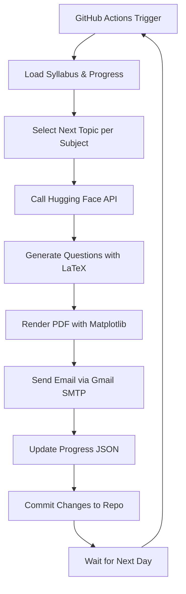

# 🔥 Daily GATE Quiz Mailer - 100% FREE!# 🔥 Daily GATE Quiz Mailer


<div align="center"># 🔥 Daily GATE Quiz Mailer — Hugging Face Edition


<div align="center">


> Automated daily email of extremely hard GATE-level questions with LaTeX math, cycling through all syllabus topics. Perfect for self-study and friends! 📘💡


**Automated daily GATE questions for you + 3 friends. Zero costs. Zero hassle.** 💸


*No credit card. No cloud bills. Just free AI + free automation!*---


</div>


---## 📂 Project Structure


## 💰 Why This is 100% FREE


| Service | Free Tier | What We Use | Cost |*Automated daily delivery of extremely hard GATE-level questions with LaTeX math rendering*```

|---------|-----------|-------------|------|

| **GitHub Actions** | 2,000 min/month | ~1 min/day = 30 min/month | **$0** |

| **Hugging Face API** | 1,000+ requests/day | 1 request/day | **$0** |

| **Gmail SMTP** | Normal usage limits | 1 email/day to 4 people | **$0** |[Features](#-features) • [Quick Start](#-quick-start) • [Tech Stack](#-tech-stack) • [Setup](#️-detailed-setup) • [Deploy](#-deployment)daily_gate_quiz_mailer/

| **GitHub Storage** | Unlimited for code | Few KB of JSON files | **$0** |

├── generate_and_send_quiz.py       # Main Python script

**Total monthly cost: $0.00** ✨

</div>├── syllabus.json                   # Subject-topic mapping

---

├── progress.json                   # Tracks last used topic per subject

## 📂 Simple Structure (Just 4 Files!)

---├── requirements.txt                # Python dependencies

```

daily_gate_quiz_mailer/└── .github/workflows/daily_quiz.yml # GitHub Actions workflow

├── generate_quiz.py              # Main script (1 file does everything!)

├── syllabus.json                 # Your GATE topics## 📖 Overview

├── progress.json                 # Auto-created progress tracker

├── requirements.txt              # 5 simple packages````

└── .github/workflows/daily.yml   # GitHub Actions (runs daily for free!)

```An intelligent automated system that generates and emails challenging GATE-level multiple-choice questions daily. Leverages AI for question generation, cycles through comprehensive syllabus topics, and delivers beautifully formatted PDFs straight to your inbox.


------


## 🎯 What You Get**Perfect for GATE aspirants, study groups, and continuous learning!** 🎓


- ✅ **1 extremely hard MCQ per subject** every day (5 subjects = 5 questions)## 🎯 Features

- ✅ **LaTeX math** rendering (looks professional!)

- ✅ **PDF attachment** emailed to you + 3 friends at 6 AM daily---

- ✅ **Auto-cycles through topics** (never repeats until all topics done)

- ✅ **Answers included** at the bottom of PDF- Generates **1 extremely hard MCQ per subject** every day.  

- ✅ **Zero maintenance** after setup (GitHub runs it automatically!)

## 📂 Project Structure- Supports **LaTeX math formatting** for formulas & symbols.  

---

- Automatically **cycles through syllabus topics** sequentially.  

## 🚀 Quick Setup (10 Minutes)

```- Saves topic progress in `progress.json`.  

### Step 1: Create GitHub Account (FREE)

1. Go to [github.com](https://github.com) and sign up (if you don't have account)daily_gate_quiz_mailer/- Creates a **neatly formatted PDF** with title, date, questions, options (A–D), and answers at the bottom.  

2. Create a new repository: Click "New" → Name it `gate-quiz` → Make it **Public** or **Private** (both free!)

├── src/- Sends PDF via **Gmail SMTP** to you and optionally friends.  

### Step 2: Create Hugging Face Account (FREE)

1. Go to [huggingface.co](https://huggingface.co) and sign up│   ├── generate_and_send_quiz.py   # Main application logic- Fully automated using **GitHub Actions** for daily delivery.  

2. Go to Settings → Access Tokens → "Create new token"

3. Name it `quiz-bot`, select **Read** permission → Create│   ├── pdf_generator.py            # PDF creation with LaTeX rendering- Optional: store previous PDFs in `/history`.  

4. **Copy the token** (starts with `hf_...`) - save it somewhere!

│   └── email_service.py            # Email delivery service- Optional: include yesterday’s answers in today’s email for self-check.  

### Step 3: Setup Gmail App Password (FREE)

1. Go to [myaccount.google.com/security](https://myaccount.google.com/security)├── config/

2. Enable **2-Step Verification** (if not already)

3. Search for "App Passwords" → Generate new → Select "Mail" and "Other"│   ├── syllabus.json               # Subject-topic mapping (customizable)---

4. **Copy the 16-character password** (looks like `abcd efgh ijkl mnop`)

│   └── progress.json               # Topic cycle tracker (auto-generated)

### Step 4: Add Files to GitHub

├── history/                        # Archived quiz PDFs (optional)## ⚙️ Setup Instructions

#### **Create `requirements.txt`:**

```├── tests/                          # Unit tests

requests

fpdf2├── .github/### 1️⃣ Install Python Dependencies

matplotlib

```│   └── workflows/```bash


#### **Create `syllabus.json`:** (Customize your subjects!)│       └── daily_quiz.yml          # CI/CD automationpip install -r requirements.txt

```json

{├── requirements.txt                # Python dependencies````

  "Algorithms": ["Sorting", "Graph Algorithms", "DP", "Greedy", "Trees"],

  "Data Structures": ["Arrays", "Linked Lists", "Stacks", "Queues", "Hash Tables"],├── .env.example                    # Environment variables template

  "Operating Systems": ["Process", "Threads", "Scheduling", "Memory", "Deadlocks"],

  "DBMS": ["SQL", "Normalization", "Transactions", "Indexing", "ER Model"],├── Dockerfile                      # Container deployment (optional)### 2️⃣ Create `syllabus.json` (Example)

  "Computer Networks": ["OSI Model", "TCP/IP", "Routing", "HTTP", "DNS"]

}└── README.md                       # You are here!

```

``````json

#### **Create `generate_quiz.py`:** (Copy this whole code!)

{

```python

import os---  "Linear Algebra": ["Vector Spaces", "Eigenvalues", "Orthogonality"],

import json

import requests  "Probability": ["Expectation", "Bayes Theorem", "Normal Distribution"],

from datetime import datetime

from fpdf import FPDF## 🎯 Features  "Algorithms": ["Sorting", "Graph Algorithms", "Dynamic Programming"]

import smtplib

from email.mime.multipart import MIMEMultipart}

from email.mime.base import MIMEBase

from email.mime.text import MIMEText### Core Capabilities```

from email import encoders

- ✅ **AI-Powered Generation** — Uses Hugging Face Inference API for high-quality questions

# Load config

with open('syllabus.json', 'r') as f:- ✅ **LaTeX Math Support** — Beautiful mathematical notation rendering### 3️⃣ API Setup

    SYLLABUS = json.load(f)

- ✅ **Smart Topic Cycling** — Sequential rotation through all syllabus topics

# Load or create progress

try:- ✅ **PDF Generation** — Professional formatting with title, date, questions, and answers* Create a **Hugging Face account** ([https://huggingface.co/](https://huggingface.co/))

    with open('progress.json', 'r') as f:

        progress = json.load(f)- ✅ **Multi-Recipient Email** — Send to yourself and study groups* Go to your **Settings → Access Tokens → Generate new token**

except FileNotFoundError:

    progress = {subject: 0 for subject in SYLLABUS.keys()}- ✅ **Progress Tracking** — Automatic state management across runs* Store the token as **GitHub Secret**: `HF_API_KEY`


# Get credentials from environment variables (GitHub Secrets)- ✅ **GitHub Actions** — Fully automated daily delivery (zero maintenance)

HF_TOKEN = os.getenv('HF_TOKEN')

GMAIL_USER = os.getenv('GMAIL_USER')### 4️⃣ Gmail Setup

GMAIL_PASS = os.getenv('GMAIL_PASS')

FRIENDS = os.getenv('FRIENDS', '').split(',')  # Comma-separated emails### Advanced Features


def generate_question(subject, topic):- 🔥 **Difficulty Levels** — Configurable question complexity* Enable **App Password** in your Gmail account

    """Generate question using Hugging Face API (FREE!)"""

    API_URL = "https://api-inference.huggingface.co/models/mistralai/Mistral-7B-Instruct-v0.2"- 📊 **Historical Archive** — Keep all previous quizzes for revision* Store in GitHub Secrets:

    headers = {"Authorization": f"Bearer {HF_TOKEN}"}

    - 🎨 **Custom Branding** — Personalize PDF headers and styling

    prompt = f"""Generate ONE extremely hard GATE-level MCQ for:

Subject: {subject}- 🔄 **Retry Logic** — Fault-tolerant API calls with exponential backoff  * `GMAIL_USER` → your email

Topic: {topic}

- 📧 **HTML Emails** — Rich formatting with inline images  * `GMAIL_APP_PASSWORD` → Gmail App Password

Format:

Q. [Question with LaTeX math using $ symbols]- 🌐 **Multi-Exam Support** — Extendable to JEE, CAT, GRE, etc.  * `FRIENDS_EMAILS` → comma-separated emails (optional)

(A) Option A

(B) Option B  

(C) Option C

(D) Option D---### 5️⃣ Progress File

Answer: (X)


Make it challenging with tricky reasoning!"""

## 🚀 Quick Start* `progress.json` stores last-used topic per subject. Example:

    payload = {"inputs": prompt, "parameters": {"max_new_tokens": 300, "temperature": 0.7}}

    

    response = requests.post(API_URL, headers=headers, json=payload, timeout=30)

    if response.status_code == 200:### Prerequisites```json

        return response.json()[0]['generated_text'].replace(prompt, '').strip()

    else:- Python 3.9+{

        return f"Q. Error generating question for {topic}\n(A) N/A\n(B) N/A\n(C) N/A\n(D) N/A\nAnswer: (A)"

- Git  "Linear Algebra": 1,

def create_pdf(questions):

    """Create PDF with all questions"""- Gmail account with App Password  "Probability": 0,

    pdf = FPDF()

    pdf.add_page()- Hugging Face account (free tier works!)  "Algorithms": 2

    pdf.set_font("Arial", "B", 16)

    pdf.cell(0, 10, f"Daily GATE Quiz - {datetime.now().strftime('%B %d, %Y')}", 0, 1, 'C')}

    pdf.ln(5)

    ### Installation (5 minutes)```

    for subject, (topic, question) in questions.items():

        pdf.set_font("Arial", "B", 12)

        pdf.cell(0, 10, f"{subject} - {topic}", 0, 1)

        pdf.set_font("Arial", "", 10)```bash* The script automatically updates this daily.

        pdf.multi_cell(0, 5, question)

        pdf.ln(5)# Clone repository

    

    filename = f"gate_quiz_{datetime.now().strftime('%Y%m%d')}.pdf"git clone https://github.com/yourusername/daily-gate-quiz-mailer.git---

    pdf.output(filename)

    return filenamecd daily-gate-quiz-mailer


def send_email(pdf_file, questions):## 📝 Hugging Face Prompt Template

    """Send email via Gmail (FREE!)"""

    msg = MIMEMultipart()# Install dependencies

    msg['From'] = GMAIL_USER

    msg['To'] = GMAIL_USERpip install -r requirements.txt```text

    msg['Subject'] = f"🔥 Daily GATE Quiz - {datetime.now().strftime('%b %d, %Y')}"

    You are an AI tutor generating **extremely hard GATE-level questions**.

    body = f"""Hello GATE Warriors! 💪

# Configure environment- Topic: {topic}

Your daily quiz is ready! Today's topics:

{''.join([f"- {subj}: {topic}" for subj, (topic, _) in questions.items()])}cp .env.example .env- Subject: {subject}


Solve all questions before checking answers at the bottom!# Edit .env with your credentials- Format: LaTeX for all math


Happy Learning! 🎓- Output: 

"""

    # Run first quiz  Q. {question in LaTeX}

    msg.attach(MIMEText(body, 'plain'))

    python src/generate_and_send_quiz.py

    # Attach PDF

    with open(pdf_file, 'rb') as f:```  (A) option A

        part = MIMEBase('application', 'octet-stream')

        part.set_payload(f.read())  (B) option B

        encoders.encode_base64(part)

        part.add_header('Content-Disposition', f'attachment; filename={pdf_file}')**That's it!** Check your email 📬  (C) option C

        msg.attach(part)

      (D) option D

    # Send to you + friends

    recipients = [GMAIL_USER] + [f.strip() for f in FRIENDS if f.strip()]---

    

    with smtplib.SMTP('smtp.gmail.com', 587) as server:Answer: (X)  # Keep separate for PDF bottom

        server.starttls()

        server.login(GMAIL_USER, GMAIL_PASS)## 🛠️ Tech Stack```

        server.send_message(msg, to_addrs=recipients)

    

    print(f"✅ Email sent to {len(recipients)} people!")

### Backend & AI---

def main():

    """Main execution"""| Technology | Purpose | Why? |

    questions = {}

    |------------|---------|------|## 📄 PDF Generation

    # Generate questions for each subject

    for subject, topics in SYLLABUS.items():| **Python 3.9+** | Core language | Fast development, rich ecosystem |

        topic_index = progress[subject] % len(topics)

        topic = topics[topic_index]| **Hugging Face API** | Question generation | SOTA language models (Llama, Mistral) |* Uses `fpdf2` + `matplotlib` for rendering LaTeX.

        

        print(f"Generating: {subject} - {topic}...")| **FPDF2** | PDF creation | Lightweight, LaTeX support |* Includes:

        question = generate_question(subject, topic)

        questions[subject] = (topic, question)| **Matplotlib** | LaTeX rendering | High-quality math typesetting |

        

        # Update progress  * Title with date & emoji header

        progress[subject] = topic_index + 1

    ### Email & Automation  * Questions with options

    # Create PDF

    print("Creating PDF...")| Technology | Purpose | Why? |  * Answers at the bottom

    pdf_file = create_pdf(questions)

    |------------|---------|------|* Optional: save PDFs in `/history` for review.

    # Send email

    print("Sending email...")| **smtplib** | Email delivery | Built-in, reliable Gmail integration |

    send_email(pdf_file, questions)

    | **GitHub Actions** | CI/CD automation | Free, zero-server deployment |---

    # Save progress

    with open('progress.json', 'w') as f:| **python-dotenv** | Config management | Secure credential handling |

        json.dump(progress, f, indent=2)

    ## 📧 Email Delivery

    print("🎉 Done! Check your email!")

### Data & Storage

if __name__ == "__main__":

    main()| Technology | Purpose | Why? |* Uses Gmail SMTP (`smtp.gmail.com`, port `587`)

```

|------------|---------|------|* Sends PDF to yourself + friends

#### **Create `.github/workflows/daily.yml`:** (GitHub Actions - runs daily for FREE!)

| **JSON** | Data persistence | Simple, human-readable |* Daily emails via GitHub Actions

```yaml

name: Daily Quiz| **Git** | Version control | Track progress, collaborative editing |


on:---

  schedule:

    - cron: '30 0 * * *'  # Runs at 6:00 AM IST (00:30 UTC) daily### Optional Enhancements

  workflow_dispatch:  # Manual trigger button

- **Docker** — Containerized deployment## 📆 GitHub Actions Workflow

jobs:

  send-quiz:- **Redis** — Caching for faster API responses

    runs-on: ubuntu-latest

    - **PostgreSQL** — Advanced analytics & user tracking**File:** `.github/workflows/daily_quiz.yml`

    steps:

      - name: Checkout- **Vercel/AWS Lambda** — Serverless execution

        uses: actions/checkout@v4

      * Runs daily at chosen time

      - name: Setup Python

        uses: actions/setup-python@v4---* Pulls repo → runs `generate_and_send_quiz.py` → emails PDF

        with:

          python-version: '3.11'* Uses GitHub Secrets for API and email credentials

      

      - name: Install packages## ⚙️ Detailed Setup

        run: pip install -r requirements.txt

      ---

      - name: Generate & Send Quiz

        env:### 1️⃣ Install Python Dependencies

          HF_TOKEN: ${{ secrets.HF_TOKEN }}

          GMAIL_USER: ${{ secrets.GMAIL_USER }}## ⚡ How it Works (Daily Loop)

          GMAIL_PASS: ${{ secrets.GMAIL_PASS }}

          FRIENDS: ${{ secrets.FRIENDS }}```bash

        run: python generate_quiz.py

      pip install -r requirements.txt1. Read `syllabus.json` → get current topic per subject.

      - name: Update progress

        run: |```2. Check `progress.json` → know which topic to generate today.

          git config user.name "Quiz Bot"

          git config user.email "bot@quiz.com"3. Call Hugging Face API → generate LaTeX-formatted questions.

          git add progress.json

          git diff --quiet && git diff --staged --quiet || git commit -m "Update progress"**requirements.txt:**4. Build PDF → render LaTeX → include answers.

          git push

``````5. Send PDF via Gmail SMTP.


### Step 5: Add GitHub Secrets (Important!)requests>=2.31.06. Update `progress.json` → next day moves to next topic.

1. In your GitHub repo, go to **Settings** → **Secrets and variables** → **Actions**

2. Click **New repository secret** and add these **4 secrets**:fpdf2>=2.7.5


| Secret Name | Value |matplotlib>=3.8.0---

|-------------|-------|

| `HF_TOKEN` | Your Hugging Face token (starts with `hf_...`) |python-dotenv>=1.0.0

| `GMAIL_USER` | Your Gmail address (e.g., `youremail@gmail.com`) |

| `GMAIL_PASS` | Your Gmail App Password (16 chars, e.g., `abcd efgh ijkl mnop`) |Pillow>=10.0.0## 💡 Tips

| `FRIENDS` | Your friends' emails separated by commas (e.g., `friend1@gmail.com,friend2@gmail.com,friend3@gmail.com`) |

```

### Step 6: Test It! (Manual Run)

1. Go to **Actions** tab in your repo* To reset topic cycle → delete `progress.json`

2. Click **Daily Quiz** workflow

3. Click **Run workflow** → **Run workflow**---* For extra difficulty → adjust Hugging Face prompt “extremely hard”

4. Wait 1-2 minutes

5. **Check your email!** 📧🎉* Use `/history` folder to keep PDFs for revision


---### 2️⃣ Create Configuration Files


## ⚡ How It Works```


1. **Every day at 6 AM**, GitHub Actions runs automatically (FREE!)#### **config/syllabus.json** (Customize your topics)

2. Script loads your syllabus and checks progress

3. For each subject, picks the next topic in rotation---

4. Calls Hugging Face API to generate 1 hard MCQ per subject (FREE!)

5. Creates a nice PDF with all questions + answers```json

6. Emails PDF to you + your 3 friends via Gmail (FREE!)

7. Updates progress.json so tomorrow it picks next topics{If you want, I can **also create a single Python script `generate_and_send_quiz.py`** that follows this README exactly, fully automated, ready to run with **Hugging Face + Gmail + LaTeX PDF** 🎯📬  

8. Commits progress back to GitHub (FREE!)

  "Linear Algebra": [

**You do NOTHING after setup. Just check email daily!** ✨

    "Vector Spaces",Do you want me to do that next?

---

    "Eigenvalues & Eigenvectors",```

## 🎨 Customize It!

    "Orthogonality",

### Change Quiz Time    "Matrix Decomposition",

Edit `.github/workflows/daily.yml`:    "Linear Transformations"

```yaml  ],

- cron: '30 0 * * *'  # 6:00 AM IST  "Probability & Statistics": [

- cron: '0 12 * * *'  # 5:30 PM IST      "Expectation & Variance",

- cron: '30 13 * * *' # 7:00 PM IST    "Bayes Theorem",

```    "Distributions (Normal, Poisson)",

Use [crontab.guru](https://crontab.guru) to find your time!    "Hypothesis Testing",

    "Markov Chains"

### Add More Subjects  ],

Edit `syllabus.json`:  "Algorithms": [

```json    "Sorting & Searching",

{    "Graph Algorithms",

  "Math": ["Calculus", "Linear Algebra", "Probability"],    "Dynamic Programming",

  "Your New Subject": ["Topic 1", "Topic 2", "Topic 3"]    "Greedy Algorithms",

}    "NP-Completeness"

```  ],

  "Computer Networks": [

### Add More Friends    "OSI Model",

Go to GitHub Secrets → Edit `FRIENDS`:    "TCP/IP",

```    "Routing Algorithms",

friend1@gmail.com,friend2@gmail.com,friend3@gmail.com,friend4@gmail.com    "Network Security",

```    "Congestion Control"

(Works for 100s of friends! Gmail allows it!)  ],

  "Operating Systems": [

---    "Process Synchronization",

    "Memory Management",

## 🔧 Troubleshooting    "Deadlocks",

    "File Systems",

| Problem | Solution |    "CPU Scheduling"

|---------|----------|  ]

| **No email received** | 1. Check spam folder<br>2. Verify GitHub Secrets are correct<br>3. Check Actions tab for errors |}

| **"API rate limit"** | Hugging Face free tier allows 1000+ requests/day. You use 1/day. Should never happen! |```

| **"Authentication failed"** | Gmail App Password incorrect. Regenerate it and update secret |

| **Workflow not running** | Enable Actions in repo settings. Check if schedule is correct |#### **config/progress.json** (Auto-generated, example)


### Manual Test Locally (on your PC):```json

```bash{

# Set environment variables in PowerShell  "Linear Algebra": 2,

$env:HF_TOKEN="your_token_here"  "Probability & Statistics": 0,

$env:GMAIL_USER="your_email@gmail.com"  "Algorithms": 4,

$env:GMAIL_PASS="your_app_password"  "Computer Networks": 1,

$env:FRIENDS="friend1@gmail.com,friend2@gmail.com"  "Operating Systems": 3

}

# Run script```

python generate_quiz.py

```---


---### 3️⃣ Hugging Face API Setup


## 💡 Pro Tips for Broke Students1. **Create Account**: Visit [https://huggingface.co/](https://huggingface.co/)

2. **Generate Token**: Settings → Access Tokens → New Token (Read permission)

1. **GitHub Actions gives 2,000 FREE minutes/month**3. **Add to Environment**:

   - This script uses ~1 min/day = 30 mins/month

   - You have 1,970 mins left for other projects! 🎉```bash

# .env file

2. **Hugging Face free tier is generous**HF_API_KEY=hf_xxxxxxxxxxxxxxxxxxxxxxxx

   - 1,000+ API calls/day for freeHF_MODEL=meta-llama/Meta-Llama-3-8B-Instruct  # or mistralai/Mistral-7B-Instruct-v0.2

   - We use 1 call/day (0.1% of limit!)```


3. **Gmail is unlimited****Recommended Models:**

   - Send to 100s of friends if you want!- `meta-llama/Meta-Llama-3-8B-Instruct` (Best quality)

   - No cost, no limits (within normal use)- `mistralai/Mistral-7B-Instruct-v0.2` (Faster)

- `google/flan-t5-xxl` (Free tier friendly)

4. **Scale it up for FREE**

   - Want 2 quizzes/day? Duplicate the workflow with different times!---

   - Want more subjects? Just edit `syllabus.json`!

   - Want harder questions? Change the prompt in `generate_quiz.py`!### 4️⃣ Gmail Setup (2 minutes)


---#### Enable App Password:

1. Go to [Google Account Security](https://myaccount.google.com/security)

## 🚀 Next Level (Still FREE!)2. Enable **2-Step Verification**

3. Generate **App Password**: Security → 2-Step Verification → App Passwords

### Save PDFs to GitHub (Free Storage)4. Copy the 16-character password

Add this to `generate_quiz.py` after creating PDF:

```python#### Add to Environment:

import shutil

os.makedirs('history', exist_ok=True)```bash

shutil.copy(pdf_file, f'history/{pdf_file}')# .env file

```GMAIL_USER=your.email@gmail.com

GMAIL_APP_PASSWORD=abcd efgh ijkl mnop  # 16-char password

Then update workflow to commit history:FRIENDS_EMAILS=friend1@gmail.com,friend2@gmail.com  # Optional

```yaml```

- name: Save history

  run: |---

    git add history/

    git commit -m "Save quiz PDF"### 5️⃣ Environment Variables (.env file)

    git push

``````bash

# AI Configuration

### Track Your ProgressHF_API_KEY=hf_xxxxxxxxxxxxxxxxxxxxxxxx

Create `stats.json` to track:HF_MODEL=meta-llama/Meta-Llama-3-8B-Instruct

- Topics covered

- Questions generated# Email Configuration

- Emails sentGMAIL_USER=your.email@gmail.com

- Streak counter!GMAIL_APP_PASSWORD=xxxx xxxx xxxx xxxx

FRIENDS_EMAILS=friend1@gmail.com,friend2@gmail.com

---

# Quiz Settings

## 🎓 Study Group IdeasDIFFICULTY_LEVEL=extremely_hard  # Options: hard, very_hard, extremely_hard

QUESTIONS_PER_SUBJECT=1

1. **Daily Discussion Group**: Create WhatsApp group, solve together at 6 PMENABLE_HISTORY=true

2. **Weekend Review**: Archive PDFs, review all week's questions on SundayHISTORY_PATH=./history

3. **Competition Mode**: First to solve all correctly wins! 🏆

4. **Teach-Back**: Each person explains 1 answer to the group# Advanced Settings

MAX_RETRIES=3

---RETRY_DELAY=5

API_TIMEOUT=30

## ❓ FAQ```


**Q: Will this really cost $0 forever?**  ---

A: YES! GitHub Actions free tier is permanent. Hugging Face free tier is permanent. Gmail is free. All services are committed to keeping free tiers!

## 📝 Hugging Face Prompt Engineering

**Q: What if GitHub removes free tier?**  

A: Extremely unlikely (it's their primary way to attract developers). But if it happens, you can run this locally with Windows Task Scheduler (still free!).**Optimized Prompt Template:**


**Q: Can I use this for JEE/CAT/other exams?**  ```python

A: Absolutely! Just change syllabus.json and modify the prompt in generate_quiz.py!PROMPT_TEMPLATE = """You are an expert GATE exam question creator specializing in {subject}.


**Q: Can I monetize this for my coaching institute?**  **Task:** Generate ONE extremely challenging multiple-choice question on the topic: {topic}

A: Yes! But then you might need paid tiers for high volume. For personal use (even 100 students), it's free!

**Requirements:**

**Q: My friends aren't getting emails?**  1. Question difficulty: GATE-level (top 10% difficulty)

A: Check their spam folders first! Then verify FRIENDS secret is formatted correctly (comma-separated, no spaces around commas).2. Use LaTeX for all mathematical expressions: $...$ (inline) or $$...$$ (block)

3. Four distinct options (A, B, C, D) with only ONE correct answer

---4. Include reasoning traps for common misconceptions

5. Test deep conceptual understanding, not just memorization

## 🌟 Final Tips

**Output Format (STRICT):**

✅ **Start simple** - Use the default syllabus first to test  Q. [Your question with LaTeX math]

✅ **Test manually** first (Step 6) before relying on daily automation  

✅ **Check Actions tab** in GitHub to see run logs  (A) [Option A]

✅ **Join r/GATE subreddit** and share this with fellow aspirants!  (B) [Option B]

✅ **Star this repo** to help others find it!(C) [Option C]

(D) [Option D]

---

Answer: (X)

<div align="center">Explanation: [Brief 1-line explanation]


**Built by broke students, for broke students! 💪****Example:**

Q. If $A$ is a $3 \times 3$ matrix with eigenvalues $\lambda_1 = 2, \lambda_2 = 3, \lambda_3 = 5$, what is $\det(A^2 - 3A + 2I)$?

*No credit card. No subscriptions. No bullshit. Just free AI helping you crack GATE!*

(A) 0

🔥 **Good luck with GATE 2026!** 🔥(B) 12

(C) 24

</div>(D) 30


---Answer: (A)

Explanation: For eigenvalue $\lambda$, eigenvalue of $A^2-3A+2I$ is $\lambda^2-3\lambda+2=(\lambda-1)(\lambda-2)$, giving eigenvalues 0, 2, 12; det = 0.

## 🎯 Summary Checklist

NOW GENERATE for:

- [ ] Created GitHub accountSubject: {subject}

- [ ] Created Hugging Face account + tokenTopic: {topic}

- [ ] Enabled Gmail 2FA + generated App Password"""

- [ ] Created new GitHub repository```

- [ ] Added all 4 files (requirements.txt, syllabus.json, generate_quiz.py, .github/workflows/daily.yml)

- [ ] Added 4 GitHub Secrets (HF_TOKEN, GMAIL_USER, GMAIL_PASS, FRIENDS)---

- [ ] Tested manually using "Run workflow" button

- [ ] Received test email successfully ✅## 📄 PDF Generation Details

- [ ] **Done! Sit back and get daily quizzes for FREE!** 🎉

### Features:
- **Header**: Title with date and emoji
- **Questions**: LaTeX-rendered math equations
- **Options**: Clean A-D formatting
- **Answers**: Separated section at bottom
- **Branding**: Custom colors and fonts

### Sample Code:

```python
from fpdf import FPDF
import matplotlib.pyplot as plt
from datetime import datetime

class QuizPDF(FPDF):
    def header(self):
        self.set_font('Arial', 'B', 16)
        self.cell(0, 10, f'🔥 Daily GATE Quiz - {datetime.now().strftime("%B %d, %Y")}', 0, 1, 'C')
        self.ln(5)
    
    def add_question(self, subject, question_data):
        # LaTeX rendering with matplotlib
        self.set_font('Arial', 'B', 12)
        self.cell(0, 10, f'{subject}:', 0, 1)
        # ... (detailed implementation in actual code)
```

---

## 📧 Email Delivery

### Features:
- **HTML Formatting**: Rich text with styling
- **PDF Attachment**: Generated quiz
- **Multiple Recipients**: CC to study group
- **Error Handling**: Retry logic with exponential backoff

### Sample Email Template:

```html
<!DOCTYPE html>
<html>
<body style="font-family: Arial, sans-serif; max-width: 600px; margin: auto;">
  <h1 style="color: #ff6b35;">🔥 Your Daily GATE Quiz is Ready!</h1>
  <p>Hello GATE Aspirant! 👋</p>
  <p>Your daily dose of challenging questions is attached. Topics covered:</p>
  <ul>
    <li><strong>Linear Algebra:</strong> Eigenvalues & Eigenvectors</li>
    <li><strong>Algorithms:</strong> Dynamic Programming</li>
    <!-- ... -->
  </ul>
  <p style="margin-top: 20px;">
    <strong>💡 Pro Tip:</strong> Attempt all questions before checking answers!
  </p>
  <hr>
  <p style="font-size: 12px; color: #666;">
    Powered by AI • Generated at {timestamp}
  </p>
</body>
</html>
```

---

## 📆 GitHub Actions Automation

### Workflow File: `.github/workflows/daily_quiz.yml`

```yaml
name: Daily GATE Quiz Mailer

on:
  schedule:
    # Runs every day at 6:00 AM IST (00:30 UTC)
    - cron: '30 0 * * *'
  workflow_dispatch:  # Manual trigger option

jobs:
  send-quiz:
    runs-on: ubuntu-latest
    
    steps:
      - name: Checkout Repository
        uses: actions/checkout@v4
      
      - name: Set up Python
        uses: actions/setup-python@v4
        with:
          python-version: '3.11'
          cache: 'pip'
      
      - name: Install Dependencies
        run: |
          pip install --upgrade pip
          pip install -r requirements.txt
      
      - name: Generate and Send Quiz
        env:
          HF_API_KEY: ${{ secrets.HF_API_KEY }}
          GMAIL_USER: ${{ secrets.GMAIL_USER }}
          GMAIL_APP_PASSWORD: ${{ secrets.GMAIL_APP_PASSWORD }}
          FRIENDS_EMAILS: ${{ secrets.FRIENDS_EMAILS }}
        run: |
          python src/generate_and_send_quiz.py
      
      - name: Commit Progress Update
        run: |
          git config user.name "GitHub Actions Bot"
          git config user.email "actions@github.com"
          git add config/progress.json history/
          git diff --quiet && git diff --staged --quiet || git commit -m "Update quiz progress [skip ci]"
          git push
```

### GitHub Secrets Setup:
1. Go to Repository → Settings → Secrets and variables → Actions
2. Add secrets:
   - `HF_API_KEY`
   - `GMAIL_USER`
   - `GMAIL_APP_PASSWORD`
   - `FRIENDS_EMAILS` (optional)

---

## 🐳 Docker Deployment (Optional)

### Dockerfile

```dockerfile
FROM python:3.11-slim

WORKDIR /app

# Install system dependencies
RUN apt-get update && apt-get install -y \
    texlive-latex-base \
    texlive-fonts-recommended \
    && rm -rf /var/lib/apt/lists/*

# Install Python dependencies
COPY requirements.txt .
RUN pip install --no-cache-dir -r requirements.txt

# Copy application
COPY . .

# Run quiz generator
CMD ["python", "src/generate_and_send_quiz.py"]
```

### Docker Compose

```yaml
version: '3.8'
services:
  quiz-mailer:
    build: .
    environment:
      - HF_API_KEY=${HF_API_KEY}
      - GMAIL_USER=${GMAIL_USER}
      - GMAIL_APP_PASSWORD=${GMAIL_APP_PASSWORD}
    volumes:
      - ./config:/app/config
      - ./history:/app/history
```

**Run:**
```bash
docker-compose up
```

---

## ⚡ How It Works (Daily Loop)



### Step-by-Step:
1. **Trigger**: GitHub Actions runs at scheduled time (e.g., 6 AM IST)
2. **Load Config**: Read `syllabus.json` and `progress.json`
3. **Topic Selection**: For each subject, get current topic index
4. **AI Generation**: Call Hugging Face API with optimized prompt
5. **LaTeX Rendering**: Use Matplotlib to convert $...$ into images
6. **PDF Creation**: Assemble questions, options, answers into PDF
7. **Email Delivery**: Send via Gmail SMTP to recipients
8. **State Update**: Increment topic indices in `progress.json`
9. **Commit**: Push updated progress to repository
10. **Archive**: Optionally save PDF to `history/` folder

---

## 💡 Pro Tips & Best Practices

### Optimization
- **Cache API Responses**: Use Redis for frequently requested topics
- **Batch Processing**: Generate multiple days ahead during off-peak hours
- **Async Operations**: Use `asyncio` for concurrent API calls

### Customization
- **Difficulty Tuning**: Adjust prompt with "moderately hard", "very hard", "olympiad-level"
- **Custom Subjects**: Add JEE Physics, CAT Quant, etc. to `syllabus.json`
- **Branding**: Modify PDF colors, fonts, logos in `pdf_generator.py`

### Troubleshooting
| Issue | Solution |
|-------|----------|
| API Rate Limit | Use free tier efficiently, cache responses |
| Email Blocked | Ensure 2FA + App Password, check spam folder |
| LaTeX Errors | Validate syntax before rendering |
| PDF Too Large | Compress images, reduce question count |

### Reset Progress
```bash
# Start topic cycle from beginning
rm config/progress.json
python src/generate_and_send_quiz.py
```

---

## 🧪 Testing

### Run Unit Tests
```bash
pytest tests/ -v
```

### Manual Test
```bash
python src/generate_and_send_quiz.py --test-mode
```

---

## 🚀 Deployment Options

### Option 1: GitHub Actions (Recommended)
- ✅ Free forever
- ✅ Zero maintenance
- ✅ Automatic updates
- ⚠️ Requires public/private repo

### Option 2: Cloud Cron (AWS Lambda / Google Cloud Functions)
- ✅ Highly scalable
- ✅ Pay-per-execution
- ⚠️ Requires cloud setup

### Option 3: Local Cron Job
```bash
# Linux/Mac
crontab -e
# Add: 0 6 * * * cd /path/to/project && python src/generate_and_send_quiz.py
```

### Option 4: Heroku Scheduler
```bash
heroku addons:create scheduler:standard
heroku addons:open scheduler
# Add task: python src/generate_and_send_quiz.py
```

---

## 📊 Analytics & Monitoring (Future)

### Planned Features:
- **Email Open Rates**: Track engagement
- **Answer Statistics**: Most missed questions
- **Topic Difficulty**: Auto-adjust based on performance
- **Leaderboard**: Gamify learning with friends

---

## 🤝 Contributing

We welcome contributions! Here's how:

1. Fork the repository
2. Create feature branch: `git checkout -b feature/amazing-feature`
3. Commit changes: `git commit -m 'Add amazing feature'`
4. Push to branch: `git push origin feature/amazing-feature`
5. Open Pull Request

---

## 📜 License

MIT License - feel free to use for personal/commercial projects!

---

## 🙋 FAQ

**Q: Can I use other AI models?**  
A: Yes! Modify `HF_MODEL` in `.env` to any Hugging Face model (OpenAI API also supported with code changes).

**Q: How to add more subjects?**  
A: Edit `config/syllabus.json` and add your topics. Progress tracking is automatic.

**Q: What if I miss a day?**  
A: No problem! Topics cycle infinitely. Trigger manually via `workflow_dispatch`.

**Q: Can I send at different times?**  
A: Yes! Edit the `cron` expression in `.github/workflows/daily_quiz.yml`.

**Q: Is my email password safe?**  
A: Absolutely! GitHub Secrets are encrypted and never exposed in logs.

---

## 📧 Support

- **Issues**: [GitHub Issues](https://github.com/yourusername/daily-gate-quiz-mailer/issues)
- **Discussions**: [GitHub Discussions](https://github.com/yourusername/daily-gate-quiz-mailer/discussions)
- **Email**: your.email@example.com

---

## 🌟 Acknowledgments

- Hugging Face for democratizing AI
- GATE aspirants community for inspiration
- Open-source contributors worldwide

---

<div align="center">

**Built with ❤️ for GATE aspirants**

⭐ Star this repo if it helped you! ⭐

[Report Bug](https://github.com/yourusername/daily-gate-quiz-mailer/issues) • [Request Feature](https://github.com/yourusername/daily-gate-quiz-mailer/issues) • [Documentation](https://github.com/yourusername/daily-gate-quiz-mailer/wiki)

</div>
